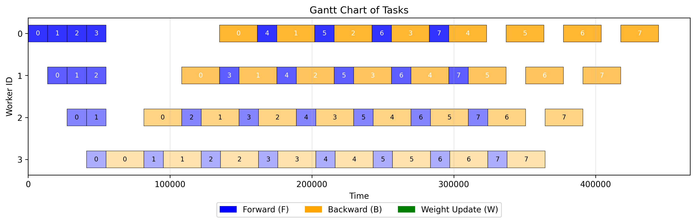
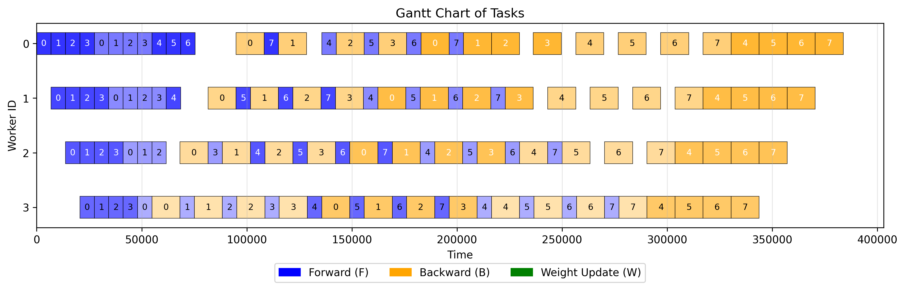
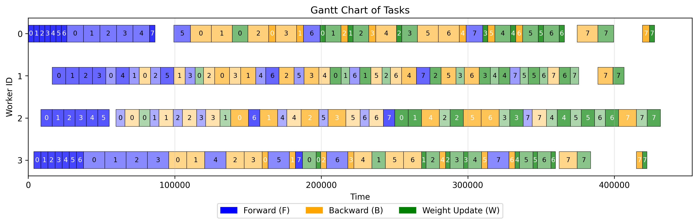

# AdapHeterPipe

**Adaptive Pipeline Parallelism for Heterogeneous GPU Clusters**

AdapHeterPipe is a pipeline parallelism simulator and optimizer for training large language models on **heterogeneous GPU clusters**. It uses Simulated Annealing to automatically search for near-optimal layer partitioning and task scheduling, significantly reducing pipeline bubble rates compared to existing methods.

## Motivation

Pipeline parallelism is widely used for distributed LLM training, but most existing scheduling strategies (1F1B, Zero Bubble, etc.) assume **homogeneous** hardware. In practice, GPU clusters are often heterogeneous — mixing different GPU types (e.g., V100, A100, H20, RTX 4090) with varying compute power, memory capacity, and interconnect bandwidth.

Naive application of homogeneous schedulers to such clusters leads to severe **pipeline bubbles**: faster devices idle while waiting for slower ones. AdapHeterPipe addresses this by jointly optimizing stage partitioning and scheduling for heterogeneous environments.

## Approach

1. **Profiling** — Model each device's compute time (F/B/W), memory capacity, and communication bandwidth using analytical FLOP models or real Megatron-LM profiling data.
2. **Simulation** — A discrete-event pipeline simulator executes any scheduling strategy on a given device configuration, tracking per-worker utilization, memory, and end-to-end time.
3. **Optimization** — A Simulated Annealing optimizer searches over the space of layer-to-device assignments and scheduling configurations to minimize total iteration time.

## Pipeline Schedule Comparison

The Gantt charts below illustrate the scheduling difference on a heterogeneous 4-GPU cluster (GPT-3 1.3B). White gaps represent idle time (pipeline bubbles).

**1F1B Schedule** (bubble rate: 39.3%)

<p align="center"></p>

**Interleaved 1F1B Schedule** (bubble rate: 33.8%)

<p align="center"></p>

**AdapHeterPipe (Ours)** (bubble rate: 8.7%)

<p align="center"></p>

## Supported Scheduling Strategies

| Strategy | Type | Description |
|---|---|---|
| 1F1B | Baseline | Standard One-Forward-One-Backward |
| Interleaved 1F1B | Baseline | Virtual pipeline stages (Megatron-LM) |
| GPipe | Baseline | Micro-batch pipelining |
| Zero Bubble | Baseline | Separated B/W passes |
| ZB V-shape | Baseline | V-shaped stage assignment for Zero Bubble |
| HexiScale | Baseline | Heterogeneous-aware pipeline parallelism |
| Zorse | Baseline | Interleaved GPipe variant |
| **AdapHeterPipe** | **Ours** | **SA-optimized partitioning + adaptive scheduling** |

## Results

Bubble rate comparison across heterogeneous configurations (lower is better):

| Method | vh45 / 760M | vh45 / 1.3B | hh55 / 760M | hh55 / 1.3B | hhvv / 13B |
|---|---|---|---|---|---|
| 1F1B | 38.9% | 39.3% | 29.0% | 32.9% | 38.8% |
| Interleaved 1F1B | 34.4% | 33.8% | 20.9% | 26.1% | 34.6% |
| Zero Bubble | 34.3% | 29.4% | 12.9% | 23.4% | 33.1% |
| ZB V-shape | 33.1% | 26.7% | 12.5% | 22.5% | 32.1% |
| Zorse | 22.1% | 28.8% | 22.5% | 29.5% | 15.7% |
| **AdapHeterPipe** | **7.0%** | **8.7%** | **10.0%** | **7.2%** | **16.2%** |

## Supported Hardware

A100 (40/80 GB), V100 (16/32 GB), RTX 3090, RTX 4090, RTX 5090, H20 (96 GB) — with configurable tensor parallelism degrees and interconnect types (PCIe, NVLink).

## Project Structure

```
├── testbed.py        # Main entry point: strategies, SA optimizer, experiments
├── simulator.py      # Discrete-event pipeline simulation engine
├── SA.py             # Simulated Annealing framework
├── my_profile.py     # Device & model profiling (Device, Model, Worker)
├── my_common.py      # Global configuration (bandwidth, debug flags, etc.)
├── visual.py         # Gantt chart & bar chart visualization
├── internode/        # Inter-node experiment scripts and figures
├── draw/             # Pre-generated baseline schedule illustrations
└── figures/          # Experiment output figures
```

## Quick Start

### Prerequisites

- Python 3.8+
- `matplotlib`, `numpy`

### Usage

```bash
# Run experiments (configure devices & model in testbed.py __main__)
python testbed.py

# Run simulator demo (ZB-Vshape on 4 workers, GPT-2 small)
python simulator.py

# Generate publication figures
python internode/draw.py
```

### Configuration

Edit `my_common.py` to toggle global settings:

| Parameter | Description | Default |
|---|---|---|
| `DEBUG` | Verbose output | `True` |
| `VISUALIZE` | Generate Gantt charts | `True` |
| `MEM_PROTECT` | Memory limit enforcement | `True` |
| `INTER_BW` | Inter-node bandwidth (Gbps) | `10` |
| `RECOMPUTE_RATIO` | Activation recomputation ratio | `0.5` |

## License

[MIT](LICENSE)
